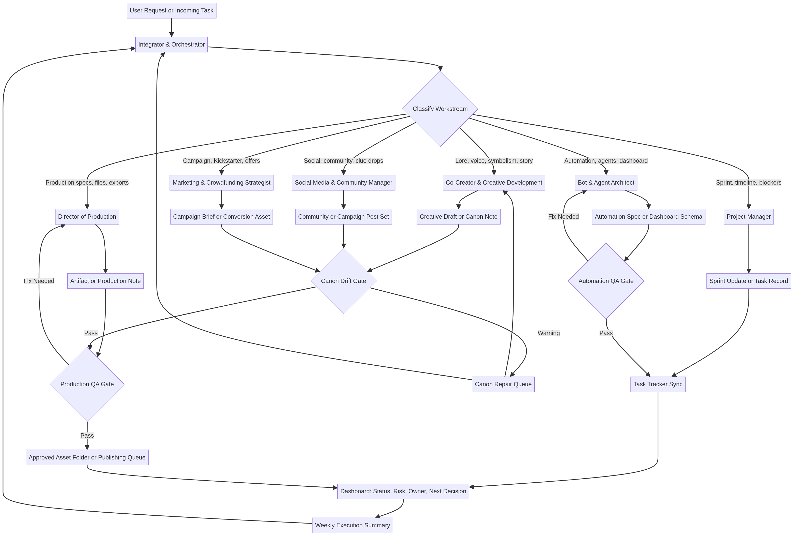
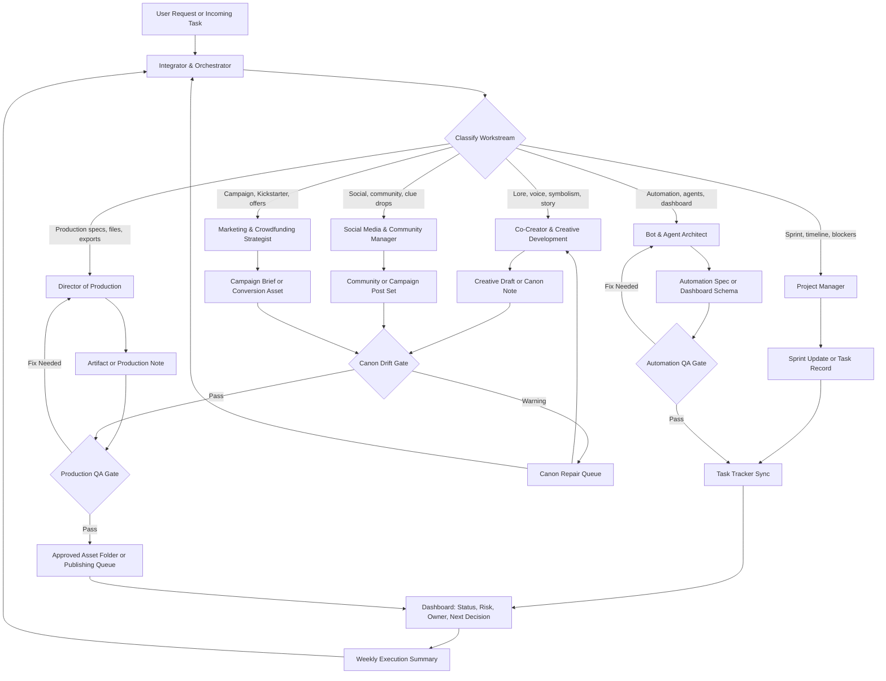

# MXD-MDA Agent Orchestration Map

**Version:** 2026-05-23 v02  
**Status:** Canonical Ops Spec, clean Markdown source  
**Author:** Manus AI  
**Primary Use:** Agent-to-agent workflow design, canon-safe delegation, task routing, QA escalation, automation restraint, and dashboard planning for MXD-MDA operations.

## 1. Decision Record

This v02 document accepts the earlier Manus orchestration map as a **Sprint Input** and converts it into a canonical operations specification. The strategic structure is retained, but the document is rebuilt from clean Markdown so the Markdown source, diagram source, rendered diagram, and PDF export can become reliable repository artifacts rather than a damaged parsed layer.

> **MXD-MDA law:** one owner, one artifact, one next decision.

The system should not ship the mythology of “done” until the relevant files are inside the real repository, tagged or versioned, tested or reviewed where applicable, and visible on the dashboard. Mythic language may frame the work, but it must never substitute for technical execution, file movement, QA, or review evidence.

| Item | v02 Decision | Operational Effect |
| --- | --- | --- |
| Prior Manus map | Accepted as Sprint Input. | Converted into clean Markdown and clean exportable PDF. |
| Agent system | Accepted as the operating model. | Agents receive defined inputs, produce defined artifacts, and hand work forward through QA gates. |
| Canon Drift Gate | Accepted and strengthened. | Canon risk becomes a visible dashboard field and a required review signal. |
| Automation | Restricted until infrastructure is confirmed. | Workflow specs may be drafted, but no live automation loops or publishing triggers should be deployed. |
| Claude and Gemini outputs | Treated as inputs, not final infrastructure. | Repo visibility, PR status, schemas, and proposed terms must be verified before automation depends on them. |

## 2. Operating Principle

MXD-MDA should run as a **coordinated agent system**, not as a loose set of disconnected helpers. Each agent receives clear input, produces a defined artifact, and hands that artifact forward with enough context to prevent canon drift, duplicate work, and vague symbolic expansion.

The **Integrator & Orchestrator** is the intake and routing role. This role receives incoming tasks, identifies the proper workstream, assigns one accountable owner, verifies canon or infrastructure risk, and routes the output through review, production, and dashboard reporting. The six working agents are **Director of Production**, **Co-Creator & Creative Development**, **Project Manager**, **Social Media & Community Manager**, **Marketing & Crowdfunding Strategist**, and **Bot & Agent Architect**.[^1]

| Agent | Operating Function | Primary Inputs | Primary Outputs | Canon Risk Level |
| --- | --- | --- | --- | --- |
| Integrator & Orchestrator | Receives tasks, routes work, checks readiness, and maintains the central map. | User request, task database, source files, project goals. | Assignment brief, routing decision, QA flags, weekly execution summary. | Medium, because routing errors can spread downstream. |
| Director of Production | Converts creative and technical requirements into platform-ready assets. | Manuscripts, image files, trim specs, EPUB/KDP requirements, asset folders. | Production-ready files, QA notes, export logs, accessibility checks. | Medium, especially when production choices alter story presentation. |
| Co-Creator & Creative Development | Develops narrative, lore, symbolic structure, riddles, fragments, and character voice. | Canon notes, story briefs, visual references, campaign hooks. | Draft copy, lore notes, puzzle concepts, narrative continuity notes. | High, because this role can introduce new symbols or contradictions. |
| Project Manager | Converts direction into sprints, milestones, dependencies, task records, and status reports. | Backlog, deadlines, owner assignments, blockers, review decisions. | Sprint plan, task updates, status table, dependency list. | Low to medium, unless task summaries distort canon-sensitive work. |
| Social Media & Community Manager | Shapes audience-facing engagement and community prompts. | Campaign brief, clue set, approved assets, platform notes. | Posts, Discord prompts, challenge rules, fan-theory prompts, engagement summaries. | High, because public clues can accidentally become canon. |
| Marketing & Crowdfunding Strategist | Frames offers, launches, Kickstarter beats, product drops, and conversion paths. | Product details, audience segments, campaign goals, asset library. | Campaign map, tier copy, landing page messaging, outreach brief. | Medium to high, because marketing simplification can flatten lore. |
| Bot & Agent Architect | Designs automation, data sync, connectors, dashboards, and agent handoff plumbing. | Workflow requirements, APIs, connectors, schema, trigger rules. | Automation specs, dashboard data model, connector plan, monitoring notes. | Medium, because automation can amplify bad metadata or stale content. |

## 3. Agent Flow Diagram

The diagram below separates **intake**, **routing**, **workstream execution**, **canon review**, **production QA**, **automation QA**, **task synchronization**, and **dashboard reporting**. This structure prevents the common failure mode where an agent produces a useful artifact but leaves no dashboard record, reviewer, next decision, or repository path.





## 4. Routing Logic and Workstream Triggers

Routing should be deterministic wherever possible. The Integrator & Orchestrator classifies work by trigger words, required artifact, risk level, and required reviewer. If a task crosses multiple domains, the first assigned agent owns the primary artifact and names the secondary reviewer in the handoff.

| Trigger Pattern | Primary Agent | Secondary Reviewer | Required Output | Dashboard Status Field |
| --- | --- | --- | --- | --- |
| “KDP,” “EPUB,” “InDesign,” “bleed,” “trim,” “alt-text,” “export,” “300 dpi.” | Director of Production | Project Manager | Production note and final file checklist. | Production QA. |
| “Lore,” “narrative,” “symbolism,” “arc,” “riddle,” “puzzle,” “Crow voice,” “story-world.” | Co-Creator & Creative Development | Integrator & Orchestrator | Creative draft with canon note. | Canon Review. |
| “Sprint,” “milestone,” “timeline,” “dependency,” “roadmap,” “status,” “blocker.” | Project Manager | Integrator & Orchestrator | Sprint table or status update. | Execution. |
| “Discord,” “community,” “Instagram,” “TikTok,” “teaser,” “Find Crow,” “fan theory.” | Social Media & Community Manager | Co-Creator & Creative Development | Platform-ready post set with approved clue/canon link. | Community Queue. |
| “Kickstarter,” “campaign,” “tier,” “conversion,” “product drop,” “outreach.” | Marketing & Crowdfunding Strategist | Director of Production | Campaign brief, CTA, or offer copy. | Campaign Build. |
| “Agent,” “automation,” “connector,” “API,” “dashboard,” “sync,” “database.” | Bot & Agent Architect | Project Manager | Automation spec or data model. | Automation Build. |

The routing rule is simple: **one owner, one artifact, one next decision**. Cross-functional work can have multiple reviewers, but it should not have multiple owners unless the task is explicitly split into separate deliverables.

## 5. Canon Drift Warning System

Canon drift occurs when an output introduces unapproved mythology, changes the emotional sequence of Crow’s transformation, or lets a public-facing clue imply facts that have not been approved. The warning system is a practical review gate, not a vague creative warning.

> **Locked canon rule:** Canonical spine: **betrayal → fracture → shards → locket**. Default symbolic palette: **whiskey glass, locket, carnival, fog, mirror, shards**. The **asterism remains dormant unless explicitly approved**.[^2]

| Warning Level | Detection Signal | Example Problem | Required Action | Owner |
| --- | --- | --- | --- | --- |
| Green | Uses approved palette and preserves the sealed chain. | A post references fog, mirror, and locket without adding new metaphysics. | Proceed to production or scheduling. | Primary agent. |
| Yellow | Adds a new symbol as scene texture but does not make it core. | A moth appears in a one-off scene but is not framed as a central omen. | Add a canon note: “Texture only, not core symbol.” Reviewer confirms. | Co-Creator or Integrator. |
| Orange | Introduces repeated new symbols, new rules, or ambiguous lore claims. | A campaign mentions a “seven-key rite” without prior approval. | Hold publication. Send to Canon Repair Queue with exact flagged phrase. | Integrator & Orchestrator. |
| Red | Contradicts the sealed chain, reorders transformation logic, uses the dormant asterism, or makes unapproved canon public. | A public teaser says the locket causes betrayal, or uses the asterism as a brand mark. | Stop handoff. Rewrite before release. Log issue in dashboard and status report. | Integrator & Orchestrator plus Co-Creator. |

The warning system should be implemented as a visible tracker field: **Canon Risk: Green / Yellow / Orange / Red / Not Applicable**. Any Orange or Red item must include the exact sentence, prompt, image element, file path, or dashboard record that triggered the warning. A warning is not actionable unless the reviewer can locate the drift.

### Canon Drift Review Prompts

| Review Question | Pass Condition | Fail Condition |
| --- | --- | --- |
| Does the output preserve **betrayal → fracture → shards → locket**? | The sequence remains intact or is not relevant to the asset. | The chain is reversed, replaced, or treated as interchangeable. |
| Does the output reuse the approved palette before inventing new core symbols? | New images are texture, not mythology. | New symbols are repeated, named, or made structurally important without approval. |
| Does the output avoid using the dormant asterism? | The asterism does not appear unless explicitly requested. | It appears as a separator, glyph, signature, logo, or clue. |
| Is Crow treated as a psychologically complex figure rather than a mascot? | Crow’s voice is playful but emotionally precise. | Crow becomes generic “spooky bird” branding or shallow trickster copy. |
| Is the public-facing hook understandable to newcomers? | The asset invites entry without requiring deep lore study. | The asset depends on unexplained internal lore or obscure references. |

## 6. Narrative Consistency Checklist

Every narrative or campaign-facing handoff should complete this checklist before it moves to production, social scheduling, or campaign deployment. The checklist is designed for fast review rather than over-management.

| Checklist Item | Required Evidence | Reviewer |
| --- | --- | --- |
| Canon spine confirmed. | A one-sentence note stating whether the sealed chain is relevant and, if so, how it is preserved. | Co-Creator. |
| Symbol palette controlled. | List of symbols used; mark each as “core palette,” “scene texture,” or “requires approval.” | Co-Creator or Integrator. |
| Voice mode named. | One label: Strategic/Producer, Crow Heyoka, Literary/Mythic, or Community/Invitation. | Primary agent. |
| Audience clarity checked. | A newcomer can understand the surface hook without a lore glossary. | Marketing or Community agent. |
| Emotional logic intact. | The work does not flatten betrayal, fracture, grief, memory, or repair into generic “dark aesthetic.” | Co-Creator. |
| Public clue risk reviewed. | If the asset contains a clue, it names the intended interpretation range and what must remain unresolved. | Community agent plus Co-Creator. |
| Production impact checked. | Formatting, image, export, accessibility, and metadata choices do not obscure narrative intent. | Director of Production. |
| Dashboard entry updated. | Task includes owner, status, due date, artifact link, canon risk, and next decision. | Project Manager. |

## 7. Agent Handoff Protocol

An agent handoff should be short enough to use repeatedly and specific enough to prevent rework. Each handoff must include **goal, scope, source files, output format, constraints, QA gate, owner, reviewer, and done condition**. The handoff should not rely on unstated MXD-MDA context.

### Standard Handoff Packet

| Field | Required Content | Example |
| --- | --- | --- |
| Task ID | Unique label tied to tracker or file name. | `MXD-OPS-AGENTMAP-2026-05-23-02` |
| Owner Agent | One responsible role. | Co-Creator & Creative Development. |
| Reviewer | One approval or QA role. | Integrator & Orchestrator. |
| Goal | Concrete result to produce. | Draft three Find Crow clue prompts for Instagram. |
| Scope | What is included and excluded. | Include clue copy and CTA; exclude final visual design. |
| Inputs | Links or file paths. | `/docs/canon/crow_arc.md`, `/assets/fog_mirror_ref/`. |
| Output Format | File, table, post set, dashboard update, or brief. | Markdown table with three variants. |
| Constraints | Voice, canon, platform, technical, timing, or legal limits. | Use approved palette; no asterism; newcomer-friendly hook. |
| QA Gate | Specific check before completion. | Canon Risk must be Green or documented Yellow. |
| Done Condition | Observable end state. | Output is ready for social review and has a dashboard link. |
| Next Decision | Human or agent decision needed. | Choose one prompt for visual production. |

### Handoff Template

```markdown
## Agent Handoff Packet

**Task ID:**  
**Owner Agent:**  
**Reviewer:**  
**Goal:**  
**Scope:**  
**Inputs:**  
**Output Format:**  
**Constraints:**  
**Canon Risk Level:** Green / Yellow / Orange / Red / Not Applicable  
**QA Gate:**  
**Done Condition:**  
**Next Decision:**  
```

### Escalation Rules

| Situation | Escalation Path | Required Note |
| --- | --- | --- |
| Canon drift suspected. | Primary agent → Co-Creator → Integrator. | Exact phrase, symbol, image, or file location that triggered concern. |
| Production spec unclear. | Primary agent → Director of Production → Project Manager. | Platform, target format, file path, missing requirement. |
| Task scope expanding. | Primary agent → Project Manager → Integrator. | Original scope, proposed expansion, impact on deadline. |
| Automation risk detected. | Bot & Agent Architect → Project Manager → Integrator. | Trigger, affected system, failure mode, rollback plan. |
| Public-facing asset ready. | Primary agent → Canon Gate → Production QA → Publishing Queue. | Approval status, scheduled location, final asset link. |

The handoff protocol should be used for all multi-agent work, especially any task that touches public copy, lore, campaign offers, automation, or production-ready files. Small internal edits may be completed in-session, but they still need a dashboard update if they affect an active milestone.

## 8. Project Visualization Plan for Dashboard

The dashboard should make the orchestration map operational. It should show **where each work item is**, **who owns it**, **whether it carries canon risk**, **what artifact exists**, and **what decision unlocks the next step**. The recommended first version is a Notion-style operations dashboard, with future automation support through connectors or APIs only after infrastructure is confirmed.

### Dashboard Views

| View | Purpose | Key Fields | Primary User |
| --- | --- | --- | --- |
| Agent Load Board | Shows work by owner agent and status. | Task Name, Owner Agent, Status, Priority, Effort, Due Date. | Project Manager. |
| Canon Risk Queue | Surfaces Yellow, Orange, and Red items before publication. | Canon Risk, Flagged Text/File, Reviewer, Fix Status, Final Decision. | Co-Creator and Integrator. |
| Production QA Queue | Tracks assets moving toward final export or publication. | Asset Link, Platform, Specs, QA Gate, File Status, Accessibility Notes. | Director of Production. |
| Campaign & Community Calendar | Coordinates social, clue drops, Kickstarter beats, and newsletter work. | Platform, Hook, CTA, Canon Link, Scheduled Date, Approved Asset. | Community and Marketing agents. |
| Automation Monitor | Tracks sync, connector, and dashboard workflows. | Trigger, Source, Destination, Last Run, Error State, Rollback Note. | Bot & Agent Architect. |
| Weekly Execution Summary | Gives leadership a clear update without digging into every task. | Completed, Blocked, Decisions Needed, Canon Flags, Next Week Focus. | Integrator and user. |

### Recommended Dashboard Schema

| Field | Type | Required | Notes |
| --- | --- | --- | --- |
| Task Name | Title | Yes | Use clear artifact-based names, not vague themes. |
| Task ID | Text | Yes | Use date and workstream prefix when possible. |
| Owner Agent | Select | Yes | One owner only. |
| Reviewer | Select | Yes for public or canon-sensitive work | Names the QA role. |
| Status | Select | Yes | Intake, Routed, Drafting, Canon Review, Production QA, Ready, Published, Blocked, Archived. |
| Priority | Select | Yes | High, Medium, Low. |
| Effort | Select | Yes | Small, Medium, Large. |
| Canon Risk | Select | Yes | Green, Yellow, Orange, Red, Not Applicable. |
| Artifact Link | URL/File | Yes when draft exists | Links to Markdown, asset folder, post set, export, or spec. |
| Source Link | URL/File | Optional | User prompt, email, Notion page, GitHub issue, or Drive file. |
| Due Date | Date | Recommended | Required for campaign and launch tasks. |
| Next Decision | Text | Yes | Names the decision needed to move forward. |
| Blocker | Text | Conditional | Required when status is Blocked. |
| Last Updated | Date | Yes | Updated whenever owner, status, risk, or artifact changes. |

### Visualization Layout

| Dashboard Zone | Visualization | Operational Question Answered |
| --- | --- | --- |
| Top Summary | Count cards for Active Tasks, Blocked, Red/Orange Canon Risk, Ready for Review. | What needs attention today? |
| Agent Columns | Kanban grouped by Owner Agent. | Who has the work now? |
| Risk Strip | Filtered table of Canon Risk Yellow/Orange/Red. | What must not ship yet? |
| Production Lane | Timeline of assets by platform and due date. | What is moving toward export or publication? |
| Campaign Lane | Calendar of posts, clue drops, newsletters, and Kickstarter beats. | What public moment is next? |
| Automation Lane | Status table for syncs, triggers, and dashboard updates. | Which systems are healthy or failing? |
| Decision Register | Table of pending user or leadership decisions. | What decision unlocks the next step? |

## 9. Automation Hold Rule

Automation should remain in **specification mode** until the infrastructure facts are visible. No Zapier, dashboard, connector, or publishing automation should be deployed until the following prerequisites are confirmed.

| Prerequisite | Required Confirmation | Reason |
| --- | --- | --- |
| GCP billing restored. | Confirmation note or operational test. | Prevents cloud-dependent workflows from failing immediately. |
| Supabase keys verified. | Secure verification without exposing secrets in docs, screenshots, or chat. | Prevents broken sync and accidental credential leakage. |
| Claude PR opened. | PR URL in dashboard. | Ensures infra changes exist in GitHub, not only a local artifact pile. |
| `api_gateway_events` schema approved. | Approved schema file or migration reference. | Prevents automation from writing to unstable tables. |
| Manus dashboard schema cleaned. | Current fields confirmed in task tracker or schema doc. | Prevents metadata drift and duplicated status systems. |

Until these conditions are met, the Bot & Agent Architect or ChatGPT Agent may draft workflow specs only. Approved specs must include trigger, action, payload, failure mode, rollback logic, dashboard field mapping, and a named reviewer.

## 10. Master Sprint Board Entries

The following entries should be added to the master sprint board or equivalent dashboard. They reflect the current instruction packet and keep work visible without claiming completion prematurely.

| Task ID | Owner | Artifact | Status | Canon Risk | Next Decision |
| --- | --- | --- | --- | --- | --- |
| MXD-INFRA-CLAUDE-01 | Claude | Infra PR | Needs repo push | N/A | Confirm PR URL. |
| MXD-ARCH-GEMINI-01 | Gemini | Architecture Review v02 | Revision needed | Yellow | Confirm proposed vs existing terms. |
| MXD-OPS-MANUS-01 | Manus | Orchestration Map v02 | Cleanup needed | Green | Re-export clean PDF. |
| MXD-AUTO-GPT-01 | ChatGPT Agent | Zapier Workflow Spec | Pending | Yellow | Wait for infra confirmation. |
| MXD-CANON-01 | Co-Creator | Canon YAML schema | Not started | Red until defined | Create first schema. |

## 11. Implementation Phases

The first implementation should remain lightweight. Create the dashboard fields, add the handoff template, and begin using the Canon Risk Queue before building complex automations. Once the workflow stabilizes, the Bot & Agent Architect can add automated task creation, weekly summary generation, or connector-based status updates.

| Phase | Practical Action | Output |
| --- | --- | --- |
| Phase 1 | Create or update task database fields for Owner Agent, Reviewer, Canon Risk, Artifact Link, and Next Decision. | Usable operations dashboard. |
| Phase 2 | Add the handoff packet template to task descriptions or a reusable page template. | Consistent agent brief format. |
| Phase 3 | Add Canon Risk Queue and Production QA Queue views. | Safer review flow before publication. |
| Phase 4 | Add weekly summary view grouped by Completed, Blocked, Decisions Needed, and Canon Flags. | Weekly execution summary source. |
| Phase 5 | Add automation only after the manual schema is stable and infra prerequisites are confirmed. | Reduced admin load without amplifying bad metadata. |

## 12. Definition of Done

This orchestration system is ready to use when every active task can answer five questions without a meeting: **Who owns it? What artifact is being produced? What canon or production risk exists? What is the next decision? Where is the current file or output?** If any answer is missing, the task is not ready for agent handoff.

For v02 specifically, the document is done when the clean Markdown source exists at `docs/operations/AGENT_ORCHESTRATION_MAP_2026-05-23_v02.md`, the clean PDF exists at `exports/MXD-MDA_Agent_Orchestration_Map_2026-05-23_v02.pdf`, the diagram source and rendered PNG are available, and the dashboard entry for `MXD-OPS-MANUS-01` can be marked ready for Integrator review.

## References

[^1]: MXD-MDA internal reference, `mxd-mda-operations/SKILL.md`; Unified Task Manager internal reference, `unified-task-manager/SKILL.md`.
[^2]: MXD-MDA internal reference, `mxd-mda-operations/references/voice-and-canon.md`.
